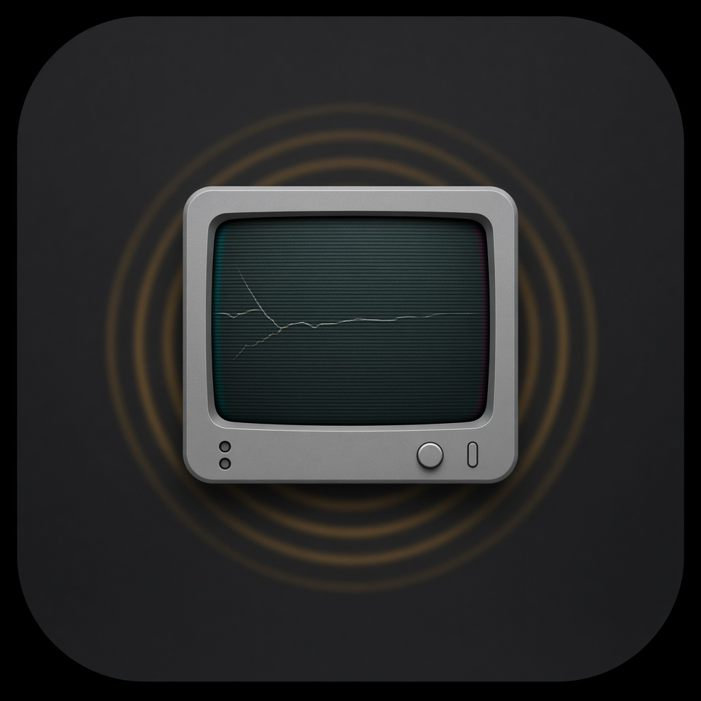

<p align="center">
  
</p>

# sMACk

Percussive maintenance for Mac. The Mac is already in the word.

Old televisions had a repair procedure. You hit them. The solder remembered its job, the picture locked, and everyone pretended this was normal. sMACk restores the ritual. At random, your desktop loses horizontal sync. Scanlines, a little RGB split, a bored electrical hum. The fix is not in System Settings. The fix is the palm of your hand on the aluminum.

## Install

macOS 14 or later. Apple silicon or Intel. Xcode is only for people changing the code.

Homebrew:

```bash
brew install --cask desxz/smacktofix/smacktofix
```

That install clears the download quarantine flag. Without a paid Apple notarization, a browser download still makes macOS say it could not verify the app.

Or download [SmackToFix.dmg](https://github.com/desxz/SmackToFix/releases/latest/download/SmackToFix.dmg), open it, and drag the app to Applications. The first time, right-click the app and choose **Open**. If the dialog only offers Done, open **System Settings → Privacy & Security** and click **Open Anyway**.

Look in the menu bar. There is no Dock icon.

## What you need

- macOS 14 or later, Apple silicon or Intel
- A Mac with a built-in microphone (the lid, not your AirPods)
- Permission to look a little unwell on a call

## Build and run

From source you also need Xcode 16 or later.

1. Open `SmackToFix.xcodeproj`.
2. Run the **SmackToFix** scheme.
3. Look in the menu bar for a cracked television. There is no Dock icon. That would be clutter, and the joke is already doing enough.

The first glitch waits at least 30 seconds, then arrives on the schedule you set. **Trigger Glitch Now** skips the wait. Use it when a camera is pointed at the screen and you would like a career in short-form video.

## Permissions

sMACk asks the first time you trigger a glitch or open **Test Slap Sensitivity**. It does not ask at launch.

- **Microphone.** On only during a glitch or a sensitivity test, and aimed at the built-in mic. It is listening for a thump, not a conversation. Nothing is recorded.
- **Screen Recording.** The glitch is the desktop, bent. Frames stay in memory and are thrown away when the set “turns off.” If you deny this, you still get an overlay of scanlines and tear bars, and clicks still pass through. The alert appears once per launch. A later glitch does not ask again.

If the switch in **System Settings → Privacy & Security → Screen Recording** is already on and the alert still appears, turn sMACk off and on again, then quit and reopen the app. A rebuilt binary is a new stranger to macOS, and the old switch does not cover it.

## The menu

- **Trigger Glitch Now** — the demo button.
- **Test Slap Sensitivity…** — a meter. Smack the side of the machine. The bar should clear the red line. Typing should not. Drag the slider if your desk is theatrical or your hands are polite.
- **Glitch frequency** — left is about 45–90 minutes. The middle, the default, is about 4–8 minutes. The right side is demo mode, about 20–45 seconds.
- **Close Glitch (⌥⎋)** — the coward’s restoration. Same collapse, less dignity. Option-Escape does this even when the menu is buried under the glitch.
- **Quit** — also works.

If nobody smacks anything, the picture gives up on its own after 75 seconds. The app will not hold your desktop hostage. That would be a different genre.

## How a smack is a smack

The detector does not use the accelerometer. It watches the built-in microphone for a short spike: loud enough to clear the threshold, sharper than a vowel, and either bassy or just plain hard. A side-of-the-case tick counts. Speech is too long. A fingertip may still be too polite.

The hum is quiet on purpose. If the speakers are doing a concert, the mic may become confused about who is hitting whom. Turn the room down, or raise the threshold.

## Safety valves

- **Option-Escape** closes the glitch from anywhere. The menu item says the same thing.
- Automatic restore at 75 seconds.
- Quit.

Your files are not part of the bit.

People changing the code should read [AGENTS.md](AGENTS.md) before touching the audio graph. It has already been wrong in ways that look like a broken microphone.
